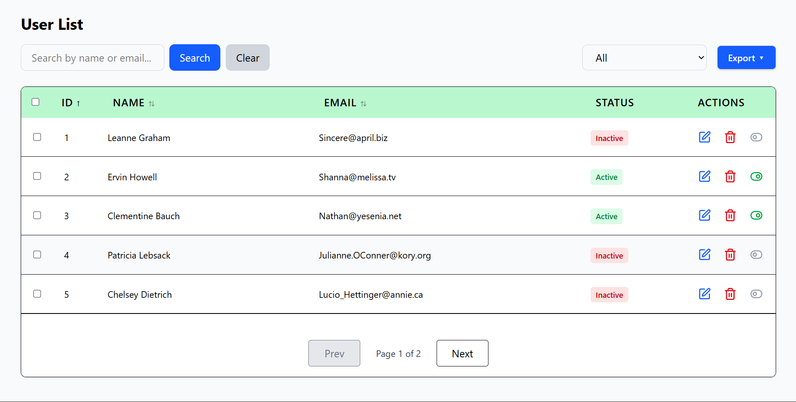

# 📊 Dynamic Data Table

A responsive and interactive data table built with React that displays user records with features like sorting, searching, filtering, pagination, row actions, row selection, and export options.  

This project was built **without using any prebuilt DataTable plugins** — all logic is implemented manually.

---

## 🚀 Features

- **Data Source**
  - Fetches user data from [JSONPlaceholder API](https://jsonplaceholder.typicode.com/users) (or mock JSON).
  - Displays: **ID, Name, Email, Status (Active/Inactive)**.

- **Table Functionalities**
  - 🔼🔽 **Sorting** → Sort by Name & Email (asc/desc).
  - 🔍 **Search** → Search by Name or Email.
  - 🎯 **Filtering** → Filter users by status (All / Active / Inactive).
  - 📑 **Pagination** → Displays 5 records per page (navigable).
  - ✅ **Row Selection** → Select single or multiple rows.
  - 📤 **Export** → Export selected or all rows in **CSV, PDF, Excel**.

- **Actions Column**
  - ✏️ **Edit** → Logs row data in console.
  - 🗑️ **Delete** → Removes row from table.
  - 🔄 **Toggle Status** → Switch Active ↔ Inactive instantly.

- **UI/UX**
  - Responsive design (works on desktop & mobile).
  - Clean & modern UI using **Tailwind CSS / Bootstrap / custom CSS**.

---

## 🖼️ Demo Screenshot



---

## ⚙️ Getting Started

### 1. Clone the repository
```bash
git clone https://github.com/thedinesh04/Frontend_Assessment_Task.git
cd Frontend_Assessment_Task
```
### 2. Install dependencies
```bash
npm install
```
### 3. Run the project
```bash
npm run dev
```
### 4. Open in browser
```bash
http://localhost:5173/
```

## 📤 Export Options
  - CSV → .csv file
  - PDF → PDF export using jsPDF
  - Excel → .xlsx file

## 🛠️ Tech Stack
  - Frontend: React.js
  - Styling: TailwindCSS
  - Export: Custom CSV/Excel logic + jsPDF
 
## 🙌 Author
  - Built with ❤️ by [Dinesh](https://github.com/thedinesh04)
